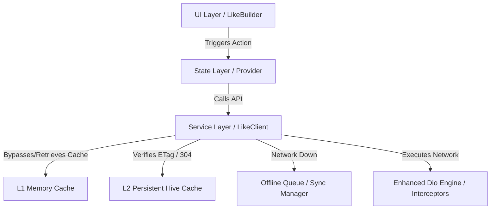

# LIKE: Link Intelligent Kernel Engine 🚀

**LIKE** is an enterprise-grade, high-performance 4-tier networking engine for Flutter designed for **Offline-First**, **Resilient**, and **Reactive** applications. Built as an advanced, highly improved wrapper on top of **Dio**, it provides standardized request control, multi-layer caching, secure media storage, automatic state orchestration, and comprehensive protocol support.

---

## 💡 Why Migrate to LIKE? (VS. Traditional HTTP / Dio)

While libraries like **Dio** or standard **HTTP** provide a solid baseline for basic web requests, they require massive amounts of custom boilerplate, caching layers, offline databases, and state handling to support a modern, offline-first production application. 

**LIKE solves this by packing the entire network, cache, security, and state lifecycle into a single high-performance engine.**

| Feature | Traditional HTTP / Dio | LIKE Engine |
| :--- | :--- | :--- |
| **Caching Model** | Standard HTTP caching only (or manual DB persistence code). | **3-Tier Hybrid Caching** (RAM + Persistent Hive + Automatic Stale-While-Revalidate). |
| **State Orchestration** | Manual boolean flags (`isLoading`, `isError`), custom variables, and manual listeners. | **Atomic State Machine** (`LikeNotifierState`) with native loading, success, SWR, error, and exception transitions. |
| **Request Cancellation** | Manual tracking of individual `CancelToken`s across UI screens and manually calling `.cancel()`. | **Zero-Boilerplate Auto-Cancellation** inside the `fetch` mixin that auto-aborts in-flight calls when a screen or provider is disposed. |
| **Data Synchronization** | Manual triggers, messy global event busses, or manual polling logic. | **Query-Aware Zero-Config Resync** using overlap checks (including date ranges) to silently update stale views on mutations. |
| **UI Performance** | Main thread JSON decoding (leads to UI jank/drops frames on payloads >100KB). | **Automated Isolate Parsing** using background Dart Isolates for heavy payloads to guarantee stable 120 FPS. |
| **Media Caching** | Standard cached network images (prone to leaks or unsecured disk access). | **Secure AES-256 Encrypted Cache** with automatic Least Recently Used (LRU) pruning and dynamic stream decryption. |
| **Offline Mutations** | App crashes or fails when offline. Requires custom SQLite/Hive sync queues. | **Persistent Offline Sync Queue** (POST/PUT/DELETE are chronologically saved and automatically synced on connection recovery). |
| **Concurrent Requests** | Duplicate HTTP requests are dispatched to the server, wasting bandwidth. | **Request Deduplication** (multiple matching in-flight calls merge into a single live stream and share the payload). |

---

## ⚡ Unified Protocol Support (HTTP / REST / GraphQL)

LIKE is built from the ground up to support modern API specifications seamlessly:

*   **REST / HTTP**: Full native abstractions for `GET`, `POST`, `PUT`, `DELETE`, and high-performance `MULTIPART` file uploads (supporting file paths, file lists, and raw in-memory byte streams via `MultipartBytesFile`).
*   **GraphQL Ready**: Highly optimized for GraphQL query and mutation payloads. By utilizing standard HTTP `POST` structures combined with LIKE's robust persistent caching, in-flight deduplication, and offline queue, you can achieve offline-first GraphQL execution with minimal setup.

---

## 🏗️ Deep Technical Architecture

LIKE abstracts away the complexities of networking, state management, and offline persistence by structuring the data lifecycle into **4 architectural tiers**:



### 1. Unified 4-Tier Lifecycle
*   **Tier 1: Service Layer (`LikeApiResult`)** — A pure data wrapper that captures raw result payloads alongside metadata (cache status, ETag 304 signals, response origin, and exceptions) with zero UI-coupling.
*   **Tier 2: Provider Layer (`LikeStateResponse`)** — A UI-aware state machine that converts raw API results into rich reactive states (`idle`, `loading`, `refreshing`, `swr`, `success`, `error`, `exception`) coupled with sticky data persistence during refreshes.
*   **Tier 3: Advanced Developer Helpers** — Boilerplate-free execution blocks like `fetcher` (automatic cancel-token rotation), `syncWith` (declarative global endpoint sync), and `loadOrFetch` (instant access or pull).
*   **Tier 4: Reactive UI Widgets (`LikeBuilder`)** — Premium widgets and slivers that automatically listen to states and render placeholders, shimmer loaders, success views, and non-blocking background progress overlays.

---

## 🛠 1. Initialization

Wrap your `MaterialApp` with the `Like` root wrapper. This widget handles the initialization of the engine (Hive, connectivity, sync) and provides global services like authentication hooks, toast notifications, and optional developer tool hooks.

```dart
void main() {
  runApp(
    Like(
      baseUrl: 'https://api.example.com',
      getToken: () async => 'current_session_token',
      refreshToken: () async => 'new_session_token',
      // Optional: Wrap the core app tree with a debug/devtool overlay
      devTool: (child) => LikeDevTool(child: child), 
      child: const MyApp(),
    ),
  );
}
```

### ⚙️ Runtime Configuration
The `Like` widget manages the entire lifecycle of the networking engine. It automatically:
- Initializes **Persistent Storage** (Hive).
- Sets up **Connectivity Monitoring**.
- Configures **Authentication Interceptors**.
- Registers **Global Toast** listeners.
- Injects a debug-only `devTool` wrapper if supplied.

### ⏳ Manual or Deferred Initialization
If you need to initialize the engine manually (e.g., inside a splash screen or custom setup flow), you can use the `LikeService` directly. It is recommended to use `addPostFrameCallback` to avoid blocking the initial render:

```dart
WidgetsBinding.instance.addPostFrameCallback((_) async {
  // Required to open Hive cache boxes and setup connectivity
  await LikeService.init(config: LikeConfig());
});
```

---

## 🏗 Tier 1: Service Layer (`LikeApiResult`)

Services return `LikeApiResult<T>`. This is a pure data wrapper that captures result metadata (cache, 304, success/error) without UI state.

```dart
class UserService {
  Future<LikeApiResult<User>> getUser(String id) async {
    return await LikeClient().get('/users/$id').mapAsync(User.fromJson);
  }
}
```

---

## 🧠 Tier 2: Provider Layer (`LikeNotifierState` & `LikeStateResponse`)

Providers convert raw `LikeApiResult` data from services into UI-ready states. LIKE provides two patterns to implement the Provider layer:

### Option A: The Modern Way (Recommended: Zero-Boilerplate `LikeNotifierState` & `fetch`)

By utilizing the self-contained `LikeNotifierState<T>` along with the unified `fetch<T>` API from `LikeAutoReconnectMixin`, you eliminate almost all manual state-handling boilerplate:
*   **Automatic CancelToken Lifecycle**: The engine handles generating, rotating, and canceling tokens under the hood.
*   **Encapsulated State**: Responses, cancel tokens, request paths, and query parameters are stored cleanly in a single `LikeNotifierState` object.
*   **Auto-Cancellation**: In-flight requests are automatically aborted when the notifier is disposed.
*   **Query-Aware Automated Resync**: Set `autoResync: true` to dynamically refresh data in the background when relevant mutations occur on the same endpoint.

```dart
class TodoNotifier extends ChangeNotifier with LikeAutoReconnectMixin {
  final _todoRepo = TodoRepository();
  
  // Declared as a single self-contained state object!
  final todosState = LikeNotifierState<List<TodoModel>>();

  /// Fetches the todo list with automated SWR, offline queuing, and resync.
  Future<void> fetchTodos({ARS? ars}) async {
    await fetch<List<TodoModel>>(
      state: todosState,
      ars: ars,
      autoResync: true, // Transparently listens for updates and resyncs!
      priority: LikeSyncPriority.normal,
      action: (ct, actionArs) => _todoRepo.getTodos(ars: actionArs),
    );
  }
}
```

### Option B: The Classic Way (Manual `fetcher` & `CancelToken`)

For cases where you prefer manual, discrete properties and custom rotation control:

```dart
class UserNotifier extends ChangeNotifier with LikeAutoReconnectMixin {
  final _userService = UserService();
  
  LikeStateResponse<User> state = LikeStateResponse.idle();
  CancelToken? _ct;

  UserNotifier() {
    initAutoReconnect(); // Required for syncWith and onReconnect
  }

  Future<void> fetchUser(String id) async {
    await fetcher<User>(
      ct: _ct,
      onRotate: (next) => _ct = next,
      onUpdate: (s) => state = s,
      action: (ct, ars) => _userService.getUser(id),
    );
  }

  @override
  void dispose() {
    super.dispose(); // CRITICAL: Cancels active sync listeners and tokens
  }
}
```

---

## ⚡ Tier 3: Advanced Developer Patterns

### 🔄 `fetcher`
**Use in**: Classic Providers/Notifiers.  
**Why**: Automates the boilerplate of rotating `CancelToken`s, setting loading states (but only when appropriate), and handling silent Dio cancellations.

### 🔗 `syncWithState` (Modern)
**Use in**: Provider initialization.  
**Why**: A streamlined, zero-boilerplate version of `syncWith` designed specifically for `LikeNotifierState`.
```dart
syncWithState<User>(
  endpoint: '/users/profile',
  state: userState,
  action: () => fetchUser(),
);
```

### 🔗 `syncWith` (Classic)
**Use in**: Classic Provider `initAutoReconnect`.  
**Why**: Declaratively refreshes data when a specific endpoint updates globally.
```dart
syncWith<User>(
  endpoint: '/users/profile',
  action: () => fetchUser(),
  state: () => state,
  cancelToken: () => _ct,
);
```

### 📥 `loadOrFetch`
**Use in**: UI or Actions.  
**Why**: "Get me the data now if you have it, otherwise fetch it and return it."
```dart
final user = await loadOrFetch(state, () => fetchUser());
```

---

## 🧠 Query-Aware Zero-Config State Resync Engine

When utilizing `fetch` with `autoResync: true`, the engine automatically orchestrates non-blocking background refreshes:
1.  **GET Tracking**: Successful `GET` network requests executed within the `fetch` block automatically bind their endpoint paths and query parameter payloads into the associated `LikeNotifierState` via transparent zone isolation.
2.  **Mutation Broadcasting**: Success signals from write operations (`POST`, `PUT`, `DELETE`) broadcast a `LikeSyncEvent` containing the endpoint and payload across `syncStream`.
3.  **Query Parameter Overlap Matching**: The engine intercepts the event and performs granular overlap analysis (including matching specific date parameters and query ranges like `startDate` / `endDate` vs `date`).
4.  **Resync Triggering**: If a match and parameter overlap is detected, the engine registers a background sync task via `LikeSyncManager` to silently refresh the stale query state without disrupting the active UI!

---

## 🎨 Tier 4: Reactive UI Widgets

### `LikeBuilder`
The primary widget for consuming `LikeStateResponse` or `LikeNotifierState`. It automatically unwraps the state, handles "sticky data" during background revalidations, and supports side-effect listeners.

```dart
LikeBuilder<User>(
  observe: () => userNotifier.userState, // Supports LikeNotifierState or LikeStateResponse
  onSuccess: (user, isRefreshing, isFromSWR) => UserProfileView(user: user),
  onLoading: () => const ShimmerLoader(),
  onRefreshing: (user) => Stack(
    children: [UserProfileView(user: user), const LinearProgressIndicator()],
  ),
  onError: (error) => ErrorView(message: error.message),
);
```

### `LikeSelector` & `LikeSelectorSliver`
Efficiently rebuilds only when a specific slice of the overall state changes, preventing unnecessary expensive tree updates. Great for CustomScrollViews or shared complex models.

```dart
LikeSelector<UserNotifier, User>(
  selector: (context, notifier) => notifier.userDetailResponse,
  onSuccess: (user, isRefreshing, isFromSWR) {
    return ProfileCard(user: user);
  },
);
```

### `LikeMultiBuilder` & `LikeMultiSliverBuilder`
Aggregates multiple concurrent `LikeStateResponse` inputs into a single combined reactive widget, ensuring all payloads are resolved and available synchronously to build unified dashboards.

```dart
LikeMultiBuilder(
  observes: [
    () => userNotifier.userDetailResponse,
    () => postNotifier.postsResponse,
  ],
  onSuccess: (results, isRefreshing, isFromSWR) {
    final user = results[0] as User;
    final posts = results[1] as List<Post>;
    return UserDashboard(user: user, posts: posts);
  },
  onLoading: () => const Center(child: CircularProgressIndicator()),
  onError: (error) => ErrorView(message: error.message),
);
```

### `LikeStateResponse` State Machine
- **`isIdle`**: Initial state.
- **`isLoading`**: First-time fetch (no data yet).
- **`isRefreshing`**: Explicit refresh (data is visible/sticky).
- **`isSWR`**: Background update (cached data is visible).
- **`isSuccess`**: Request completed with data.
- **`isError`**: API error (e.g., 500).
- **`isException`**: Client-side failure (e.g., No Internet).

---

## 🛠️ Advanced Core Features & Capabilities

### 💾 1. Hybrid Multi-Layer Cache System
LIKE implements a highly optimized, 3-tier caching structure:
1.  **L1 Cache (RAM)**: Fast-access memory store managed inside `LikeRequestRegistry` for instant screen transition retrieval.
2.  **L2 Cache (Disk)**: Persistent Hive storage. Automatically extracts and stores **ETag** headers, enabling network-level validation via **HTTP 304 Not Modified** responses to save bandwidth.
3.  **L3 (Stale-While-Revalidate / SWR)**: Returns local cached data immediately to keep the UI interactive while initiating a silent background network fetch to revalidate and update the local store.

### 🔄 2. Resiliency & Graceful Degradation
*   **Offline Fallback**: Serves stale cache data automatically if a user makes a query while offline.
*   **Error / Exception Fallback**: If a live request fails due to a server crash (5xx) or timeout, LIKE automatically intercepts the failure and serves the last-known cache as a resiliency fallback.

### 📥 3. Persistent Offline Synchronization Queue
All data mutations (`POST`, `PUT`, `DELETE`) are queued inside a persistent Hive offline box if the network is down.
*   **Background Synchronization**: Syncs tasks automatically in the background using `Workmanager` or during runtime when network connectivity is recovered.
*   **Idempotency**: Requests are retried in chronological order with smart status verification to prevent duplicate server actions.

### 🚀 4. Performance & High-Concurrency Controls
*   **Background Parsing (Isolates)**: Automatically offloads heavy JSON string parsing (>100KB) from the main UI thread to a background Dart Isolate using the `compute` API, ensuring consistent 120 FPS rendering.
*   **Concurrent Request Deduplication**: Prevents multiple in-flight requests for the identical resource. Subsequent matching calls join the active in-flight request, sharing the final network payload.
*   **Throttling & Rate-Limiting**: Throttles rapid identical requests and provides native **HTTP 429 Too Many Requests** handling by honoring server `Retry-After` headers.

---

## 🔒 5. Encrypted Image Cache (L2 Disk Caching)

LIKE includes a built-in secure disk and memory caching system tailored for images to prevent sensitive user data exposure.

### 🛡️ AES-CBC 256-Bit Secure Caching
Through `AppCacheManager` and `EncryptedHttpFileService`, images downloaded over HTTP are encrypted on-the-fly via AES-CBC 256-bit cryptography using a secure 32-character key before writing to disk.

```dart
// The engine handles decryption transparently inside temporary application directories
final stream = AppCacheManager().getFileStream(imageUrl);
```

### 🧹 Automatic LRU Pruning
To keep the app's footprint small, the image caching system monitors disk size at startup and automatically prunes files based on Least Recently Used (LRU) order when limits are reached:
- **`maxImageCacheMB`** (Default: `500.0`): Maximum storage limit.
- **`minImageCacheMB`** (Default: `400.0`): Pruning target when size is exceeded.
- **`imageStalePeriod`** (Default: `90` days): Retention threshold.

### 🖼️ `LikeCacheImage` Drop-In Widget
Use `LikeCacheImage` as a premium network image widget. It removes query parameters (such as tokens or tracking identifiers) automatically using `AppCacheUtils.normalizeUrl` to ensure consistent cache hits.

```dart
LikeCacheImage(
  imageUrl: 'https://example.com/avatar.png?token=xyz123',
  fit: BoxFit.cover,
  width: 100,
  height: 100,
  placeholder: (context, url) => const ShimmerLoader(),
  errorWidget: (context, url, err) => const Icon(Icons.broken_image),
);
```

---

## 🎭 6. Network Mocking System (API Simulations)

LIKE provides a persistent, Hive-backed mocking engine allowing developers to intercept API calls and return custom mock payloads inside testing, staging, or dev environments.

### 🧭 Matching Mock Rules
A `MockRule` defines what requests to hijack. It supports matching against:
1. **HTTP Method**: `GET`, `POST`, `PUT`, `DELETE` (or `ANY`).
2. **Base URL / Paths**: Literal match or custom RegEx matching.
3. **Query Parameters / Headers / Request Body**: Matches substrings or custom RegEx targets.

### 🎛️ Registering Mock Rules via `MockController`
Register rules dynamically. Once configured and enabled, `LikeMockInterceptor` intercepts requests immediately in the client pipeline.

```dart
final mockCtrl = MockController();
await mockCtrl.init(); // Opens storage and loads active rules

// Register a new mock endpoint
await mockCtrl.addRule(
  MockRule(
    id: 'mock_profile_fetch',
    name: 'Get User Profile',
    pathPattern: '/users/profile',
    method: 'GET',
    statusCode: 200,
    responseBody: jsonEncode({
      'status': 200,
      'data': {'id': '123', 'name': 'Jane Doe', 'role': 'Lead Dev'},
      'message': 'Success'
    }),
  ),
);

// Toggle mocking engine globally
await mockCtrl.setEngineEnabled(true);
```

---

## 📝 7. Enhanced API & FormData Logging

The built-in `LikeLoggerInterceptor` has been upgraded to automatically parse, structure, and print **Query Parameters** and **Multipart Form Data (`FormData`)** to the developer console, significantly speeding up multipart file uploads and search endpoint debugging.

---

## 🧪 8. Customizing Response Unpacking

By default, LIKE expects a flat JSON response. If your API wraps data in a standard envelope (e.g., JSend or similar), use `DefaultLikeUnpacker`. 

> [!IMPORTANT]
> This is critical for **Error Handling**. Without these keys, the engine cannot extract the `message` or `status` from your API's custom envelope, leading to generic "Unknown Error" states.

```dart
// Handles: { "status": 200, "data": { "id": 1 }, "message": "Success" }
LikeConfig(
  unpacker: const DefaultLikeUnpacker(
    dataKey: 'data',        // Where the payload lives
    messageKey: 'message',  // Where the error/success message lives
    statusKey: 'status',    // Where the business status code lives
  ),
)
```

---

## 🤝 Connect & Contribute

Support the project or reach out for collaboration:

- **GitHub**: [@AjayJasperJ](https://github.com/AjayJasperJ)
- **LinkedIn**: [Ajay Jasper J](https://in.linkedin.com/in/ajay-jasper-j-8563852b4)
- **Instagram**: [@ajayjasper.j](https://www.instagram.com/ajayjasper.j)
- **Email**: [ajayjasperj@outlook.com](mailto:ajayjasperj@outlook.com)
