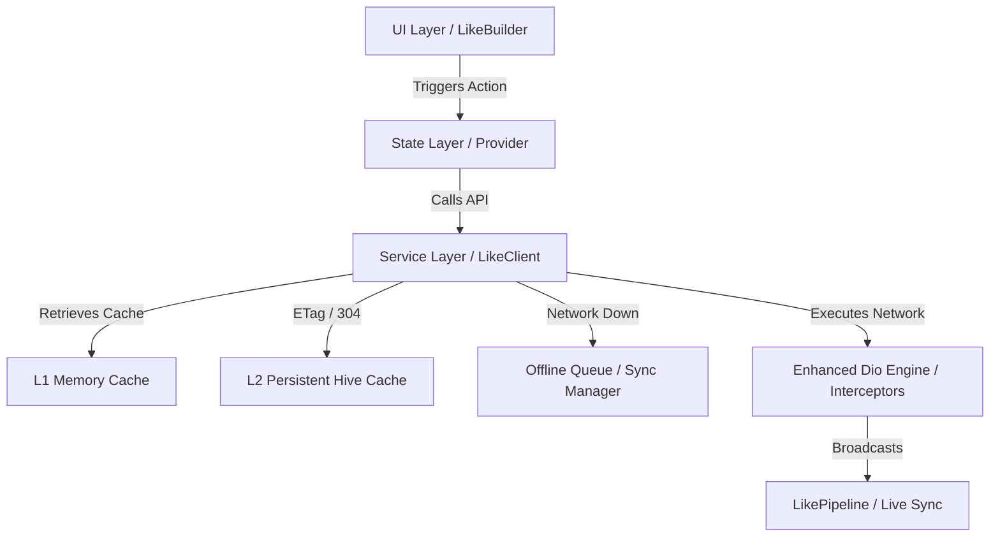

LIKE: Link Intelligent Kernel Engine 🚀

https://raw.githubusercontent.com/AjayJasperJ/like_docs/refs/heads/main/assets/banner.png

**LIKE** is an enterprise-grade, high-performance 4-tier networking engine for Flutter designed for **Offline-First**, **Resilient**, and **Reactive** applications. Built as an advanced wrapper on top of **Dio**, it provides standardized request control, multi-layer caching, secure media storage, automatic state orchestration, real-time pipeline synchronization, and comprehensive protocol support.

**Reference**: https://github.com/AjayJasperJ/like_docs

---

## 💡 Why LIKE? (vs. Traditional HTTP / Dio)

| Feature                  | Traditional HTTP / Dio                     | LIKE Engine                                                                                                         |
| :----------------------- | :----------------------------------------- | :------------------------------------------------------------------------------------------------------------------ |
| **Caching Model**        | Standard HTTP only (or manual DB code).    | **3-Tier Hybrid Caching** (RAM + Hive + Stale-While-Revalidate).                                                    |
| **State Orchestration**  | Manual boolean flags and custom listeners. | **Atomic State Machine** (`LikeNotifierState`) with native loading, success, SWR, error, and exception transitions. |
| **Live Sync**            | Manual global event buses or polling.      | **Zero-Config Pipeline Sync** — mutations auto-update every screen observing the same endpoint.                     |
| **Request Cancellation** | Manual `CancelToken` tracking per screen.  | **Zero-Boilerplate Auto-Cancellation** via `fetch` — tokens rotate and cancel on dispose.                           |
| **UI Performance**       | Main-thread JSON decoding causes jank.     | **Automated Isolate Parsing** for payloads >100 KB — guarantees 120 FPS.                                            |
| **Media Caching**        | Unsecured disk access.                     | **Per-Device AES-256 Encrypted Cache** with LRU pruning and transparent stream decryption.                          |
| **Offline Mutations**    | App crashes or needs custom sync queues.   | **Persistent Offline Sync Queue** — POST/PUT/DELETE saved and auto-replayed on reconnect with fresh auth tokens.    |
| **Concurrent Requests**  | Duplicate requests waste bandwidth.        | **Request Deduplication** — matching in-flight calls merge into a single stream.                                    |

---

## ⚡ Unified Protocol Support

- **REST / HTTP**: Full abstractions for `GET`, `POST`, `PUT`, `DELETE`, and high-performance `MULTIPART` file uploads.
- **GraphQL Ready**: Leverages standard HTTP `POST` with LIKE's persistent caching, deduplication, and offline queue for offline-first GraphQL execution.

---

## 🏗️ 4-Tier Architecture



- **Tier 1 — Service (`LikeApiResult`)**: Pure data wrapper capturing payload + metadata (cache status, ETag 304, origin).
- **Tier 2 — Provider (`LikeStateResponse`)**: UI-aware state machine converting API results into reactive states with correct loading/refreshing/SWR transitions.
- **Tier 3 — Developer Helpers**: `fetch`, `fetcher`, `syncWith`, `syncWithState`, `loadOrFetch` — zero-boilerplate orchestration blocks.
- **Tier 4 — Reactive Widgets**: `LikeBuilder`, `LikeSliverBuilder`, `LikeSelector`, `LikeMultiBuilder` — automatically render placeholders, loaders, success views, and SWR overlays.

---

## 🛠 1. Initialization

Wrap your `MaterialApp` with the `Like` root wrapper. It initializes Hive, connectivity, image cache encryption, auth interceptors, and toast services in one call.

```dart
void main() {
  runApp(
    Like(
      baseUrl: 'https://api.example.com',
      getToken: () async => 'current_session_token',
      refreshToken: () async => 'new_session_token',
      devTool: (child) => LikeDevTool(child: child), // optional debug overlay
      child: const MyApp(),
    ),
  );
}
```

### ⚙️ What `Like` Sets Up Automatically

- **Persistent Storage** (Hive)
- **Per-Device Image Cache Encryption** (`AppCacheSecurity.init()` — AES-256, unique key per install)
- **Connectivity Monitoring**
- **Authentication Interceptors**
- **Global Toast Listeners**

### ⏳ Manual Initialization

```dart
WidgetsBinding.instance.addPostFrameCallback((_) async {
  await LikeService.init(config: LikeConfig(
    baseUrl: 'https://api.example.com',
    encryptionKey: 'your-optional-app-key', // SHA-256 derived; omit for per-device key
  ));
});
```

> [!IMPORTANT]
> `LikeService.init()` initializes image-cache encryption **before** Hive storage, so `AppCacheManager` is always ready before any file access occurs.

---

## 🏗 Tier 1: Service Layer

Services return `LikeApiResult<T>` — a pure data wrapper with no UI coupling.

```dart
class UserService {
  Future<LikeApiResult<User>> getUser(String id) async {
    return await LikeClient().get('/users/$id').mapAsync(User.fromJson);
  }
}
```

---

## 🧠 Tier 2: Provider Layer

### Option A — Recommended: Zero-Boilerplate `LikeNotifierState` + `fetch`

`LikeNotifierState<T>` is now a **reactive `ChangeNotifier`** — calling `.clear()` or any state mutation instantly drives all observing `LikeBuilder` widgets to rebuild without a manual `notifyListeners()` call.

```dart
class TodoNotifier extends ChangeNotifier with LikeAutoReconnectMixin {
  final _repo = TodoRepository();

  // Self-contained, reactive state object
  final todosState = LikeNotifierState<List<TodoModel>>(
    // Optional: provide a mapper to enable zero-config pipeline sync
    mapper: (json) => (json as List).map(TodoModel.fromJson).toList(),
  );

  Future<void> fetchTodos({ARS? ars}) async {
    await fetch<List<TodoModel>>(
      state: todosState,
      ars: ars,
      autoResync: true,
      priority: LikeSyncPriority.normal,
      action: (ct, actionArs) => _repo.getTodos(ars: actionArs),
    );
  }
}
```

**When `mapper` is defined on `LikeNotifierState`**, `fetch()` automatically wires a pipeline binding — any network response for the same endpoint/query broadcast on the internal `LikePipeline` updates the state instantly on every screen, with no extra code at the call site.

### Option B — Classic: Manual `fetcher` + `CancelToken`

```dart
class UserNotifier extends ChangeNotifier with LikeAutoReconnectMixin {
  final _service = UserService();

  LikeStateResponse<User> state = LikeStateResponse.idle();
  CancelToken? _ct;

  UserNotifier() {
    initAutoReconnect();
  }

  Future<void> fetchUser(String id) async {
    await fetcher<User>(
      ct: _ct,
      onRotate: (next) => _ct = next,
      onUpdate: (s) => state = s,
      action: (ct, ars) => _service.getUser(id),
    );
  }

  @override
  void dispose() {
    super.dispose(); // Cancels active sync listeners and tokens
  }
}
```

**Correct state transitions in `fetcher`:**

- `ars.refresh == false` (clean/initial load) → immediately transitions to `LikeStateResponse.loading()`.
- `ars.refresh == true` + existing data → transitions to `LikeStateResponse.refreshing(currentData)` so sticky data stays visible.

---

## ⚡ Tier 3: Developer Helpers

### 🔄 `fetcher`

Automates `CancelToken` rotation, loading/refreshing state transitions, and silent Dio cancellation handling.

### 🔗 `syncWithState` (Modern)

Declaratively refreshes a `LikeNotifierState` when a specific endpoint is mutated globally.

```dart
syncWithState<User>(
  endpoint: '/users/profile',
  state: userState,
  action: () => fetchUser(),
);
```

### 🔗 `syncWith` (Classic)

```dart
syncWith<User>(
  endpoint: '/users/profile',
  action: () => fetchUser(),
  state: () => state,
  cancelToken: () => _ct,
);
```

### 📥 `loadOrFetch`

Returns cached data instantly or fetches if unavailable.

```dart
final user = await loadOrFetch(state, () => fetchUser());
```

---

## 🔁 Zero-Config Pipeline Synchronization

When `LikeNotifierState` is given a `mapper`, LIKE's `LikePipeline` handles cross-screen live sync automatically:

1. A successful network `GET` inside `fetch()` binds the endpoint path + query to the state via Zone injection.
2. Any write (`POST`/`PUT`/`DELETE`) on that endpoint broadcasts a pipeline event.
3. Path + query overlap is verified — if matched, the state is updated instantly on **every screen** observing it.
4. The in-flight race guard suppresses updates while the state is actively loading or refreshing.

---

## 🎨 Tier 4: Reactive UI Widgets

### `LikeBuilder<T>`

The primary widget for consuming `LikeStateResponse` or `LikeNotifierState`. It subscribes directly to `LikeNotifierState` as a `Listenable`, rebuilding automatically on any mutation.

**Correct loading behavior (v1.2.1):**

- `LikeState.loading` → **always** renders `onLoading` (no sticky data leak from a previous session).
- `LikeState.refreshing` → renders `onSuccess(data, isRefreshing: true, ...)` keeping old data visible.
- `LikeState.staleWhileRevalidate` → renders `onSuccess(data, ..., isFromSWR: true)`.

```dart
LikeBuilder<User>(
  observe: () => userNotifier.userState, // LikeNotifierState or LikeStateResponse
  onSuccess: (user, isRefreshing, isFromSWR) {
    return Stack(children: [
      UserProfileView(user: user),
      if (isRefreshing) const LinearProgressIndicator(),
    ]);
  },
  onLoading: () => const ShimmerLoader(),
  onError: (error) => ErrorView(message: error.message),
);
```

### `LikeSliverBuilder<T>`

Same semantics as `LikeBuilder` but returns `List<Widget>` slivers for use inside `CustomScrollView`.

```dart
LikeSliverBuilder<List<Todo>>(
  observe: () => todoNotifier.todosState,
  onSuccess: (todos, isRefreshing, isFromSWR) => [
    SliverList(delegate: SliverChildBuilderDelegate(
      (ctx, i) => TodoTile(todo: todos[i]),
      childCount: todos.length,
    )),
  ],
  onLoading: () => [const SliverFillRemaining(child: ShimmerLoader())],
);
```

### `LikeSelector` & `LikeSelectorSliver`

Rebuilds only when a specific slice of state changes — ideal for shared complex models.

```dart
LikeSelector<UserNotifier, User>(
  selector: (context, notifier) => notifier.userState,
  onSuccess: (user, isRefreshing, isFromSWR) => ProfileCard(user: user),
);
```

### `LikeMultiBuilder` & `LikeMultiSliverBuilder`

Aggregates multiple states into one unified widget.

```dart
LikeMultiBuilder(
  observes: [
    () => userNotifier.userState,
    () => postNotifier.postsState,
  ],
  onSuccess: (results, isRefreshing, isFromSWR) {
    final user = results[0] as User;
    final posts = results[1] as List<Post>;
    return UserDashboard(user: user, posts: posts);
  },
  onLoading: () => const Center(child: CircularProgressIndicator()),
  onError: (error) => ErrorView(message: error.message),
);
```

### `LikeWhen<T>`

Pattern-matching shorthand for simple state-to-widget mapping.

### `LikeStateResponse` State Machine

| State                  | Meaning                 | `LikeBuilder` renders                 |
| ---------------------- | ----------------------- | ------------------------------------- |
| `idle`                 | Initial / cleared       | `onIdle`                              |
| `loading`              | First fetch, no data    | `onLoading` (always — no sticky leak) |
| `refreshing`           | Explicit refresh        | `onSuccess(data, true, false)`        |
| `staleWhileRevalidate` | Background revalidation | `onSuccess(data, false, true)`        |
| `success`              | Fresh data              | `onSuccess(data, false, false)`       |
| `error`                | API error               | `onError`                             |
| `exception`            | Client-side failure     | `onException`                         |

---

## 💾 Hybrid Multi-Layer Cache System

1. **L1 Cache (RAM)** — Per-client `LikeRequestRegistry` (not a global singleton) for instant screen-transition retrieval.
2. **L2 Cache (Disk / Hive)** — Persistent storage with ETag extraction and HTTP 304 validation.
3. **L3 (Stale-While-Revalidate)** — Returns cached data immediately, then silently revalidates in the background.

---

## 🔒 Encrypted Image Cache

### Per-Device AES-256 Encryption

`AppCacheSecurity` generates a cryptographically random 32-byte key on first install and persists it in `SharedPreferences`. A fresh random 16-byte IV is generated **per file** at write time (format: `[16-byte IV][AES-CBC ciphertext]`), so every cached image is independently decryptable.

You can supply your own key via `LikeConfig.encryptionKey` — LIKE derives a stable 32-byte key from it via SHA-256.

### `LikeCacheImage` Widget

Drop-in widget that removes query tokens automatically for consistent cache hits.

```dart
LikeCacheImage(
  imageUrl: 'https://example.com/avatar.png?token=xyz',
  fit: BoxFit.cover,
  width: 100,
  height: 100,
  placeholder: (ctx, url) => const ShimmerLoader(),
  errorWidget: (ctx, url, err) => const Icon(Icons.broken_image),
);
```

### LRU Pruning

| Config               | Default    | Description                     |
| -------------------- | ---------- | ------------------------------- |
| `maxImageCacheMB`    | `500.0` MB | Pruning is triggered above this |
| `minImageCacheMB`    | `400.0` MB | Pruning target                  |
| `imageStalePeriod`   | `90` days  | Retention threshold             |
| `maxImageCacheItems` | `5000`     | Max unique cached images        |

---

## 📡 Persistent Offline Sync Queue

All `POST`/`PUT`/`DELETE` mutations are persisted in a Hive box when the network is down and auto-replayed in chronological order when connectivity is restored.

**Auth-aware replay (v1.2.0+):** Before replaying each queued request, a fresh auth token is fetched via `LikeAuthInterceptor.getToken`. If the token has expired (tokens typically live 15–60 min), the replay uses the refreshed credential — fixing 401 errors for long-lived offline sessions.

> [!NOTE]
> `workmanager` is no longer a dependency. Offline sync is driven entirely by `LikeConnectivityManager` reacting to foreground connectivity changes, making LIKE fully platform-agnostic (Android, iOS, Web, macOS, Windows, Linux).

---

## 🎭 Network Mocking System

LIKE includes a persistent, Hive-backed mocking engine for intercepting API calls in dev/staging.

```dart
final mockCtrl = MockController();
await mockCtrl.init();

await mockCtrl.addRule(
  MockRule(
    id: 'mock_profile',
    name: 'Get User Profile',
    pathPattern: '/users/profile',
    method: 'GET',
    statusCode: 200,
    responseBody: jsonEncode({'status': 200, 'data': {'id': '1', 'name': 'Jane'}}),
  ),
);

await mockCtrl.setEngineEnabled(true);
```

---

## 🧪 Customizing Response Unpacking

```dart
LikeConfig(
  unpacker: const DefaultLikeUnpacker(
    dataKey: 'data',       // Where payload lives
    messageKey: 'message', // Error/success message key
    statusKey: 'status',   // Business status code key
  ),
)
```

> [!IMPORTANT]
> Without `unpacker`, LIKE cannot extract `message` or `status` from custom API envelopes, leading to generic "Unknown Error" states.

---

## 📝 Logging

`LikeLoggerInterceptor` structures and prints request/response details — query parameters, headers, multipart form data — to the developer console. Sensitive headers (e.g., `Authorization`) are masked automatically.

---

## 🤝 Connect & Contribute

- **GitHub**: [@AjayJasperJ](https://github.com/AjayJasperJ)
- **LinkedIn**: [Ajay Jasper J](https://in.linkedin.com/in/ajay-jasper-j-8563852b4)
- **Instagram**: [@ajayjasper.j](https://www.instagram.com/ajayjasper.j)
- **Email**: [ajayjasperj@outlook.com](mailto:ajayjasperj@outlook.com)
