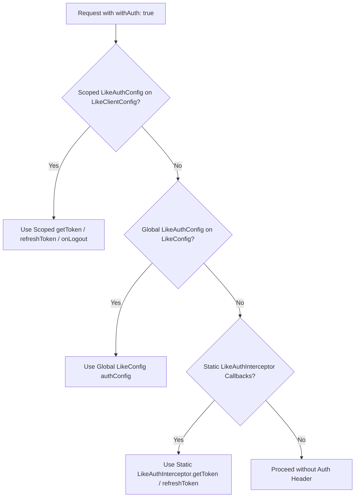

# Multi-Client Support in LIKE (`like`)

The `like` package supports **unlimited, fully isolated, anti-fragile multi-client and multi-tenant networking architectures**. Modern applications often talk to multiple backend microservices, third-party APIs, or distinct client contexts (e.g. Primary User API vs. Secondary System/Payment API) with different authentication strategies, headers, or base URLs.

---

## 1. Comparison: BEFORE vs. NOW

| Feature                                 | BEFORE                                                                                                               | NOW                                                                                                                                                                                                 |
| :-------------------------------------- | :------------------------------------------------------------------------------------------------------------------- | :-------------------------------------------------------------------------------------------------------------------------------------------------------------------------------------------------- |
| **Client Instances**              | Single global singleton client model. All requests shared the same default client configuration.                     | **Unlimited Isolated Scoped Clients** via `LikeClient.scoped(config)` + Default global instance.                                                                                            |
| **Authentication & Tokens**       | Static global callbacks attached directly to`LikeAuthInterceptor.getToken`. Token changes affected the entire app. | **Isolated `LikeAuthConfig`**. Each client instance (`userClient`, `systemClient`) maintains its own `getToken`, `refreshToken`, `onLogout`, and `getApiKey`.                   |
| **401 Refresh Mutex**             | Global token refresh lock. When Client A refreshed a token, Client B was blocked.                                    | **Instance-Scoped Locks**. Concurrent 401 refresh completers are localized per `LikeAuthConfig` / interceptor instance. Client A refresh never locks Client B.                              |
| **Auth Resolution Hierarchy**     | Standard static callbacks.                                                                                           | **3-Tier Resolution System**: `Scoped LikeAuthConfig` $\rightarrow$ `Global LikeConfig.authConfig` $\rightarrow$ `Static LikeAuthInterceptor callbacks` (100% backward compatible). |
| **Offline Sync & Storage Safety** | Uninitialized Hive access could trigger runtime exceptions if storage opened late.                                   | **Defensive Storage Guarding**. Interceptors check `Hive.isBoxOpen` before disk operations, preserving anti-fragile startup behavior.                                                       |
| **Request Retry Auth Safety**     | Retried requests risked re-running`onRequest` and overwriting fresh tokens with stale ones.                        | `!isRetry` check prevents `Authorization` header pollution on retried requests.                                                                                                                 |

---

## 2. The 3-Tier Authentication Hierarchy

When a request is executed with `withAuth: true`, the engine resolves authentication tokens using a 3-tier fallback chain:



1. **Scoped Instance `LikeAuthConfig`** *(Priority 1)*: Defined on `LikeClientConfig` when instantiating `LikeClient.scoped()`. Isolated to that specific client.
2. **Global `LikeAuthConfig`** *(Priority 2)*: Defined inside `LikeConfig` passed to `LikeConstants.apply()` or `LikeService.init()`. Evaluated dynamically for any client that does not supply a scoped override.
3. **Legacy Static Callbacks** *(Priority 3)*: Fallback to `LikeAuthInterceptor.getToken`, `LikeAuthInterceptor.refreshToken`, etc., for 100% backward compatibility.

---

## 3. Code Examples

### A. Creating Scoped Clients for Different Services

```dart
// 1. Primary Client with isolated user JWT tokens
final userClient = LikeClient.scoped(
  LikeClientConfig(
    baseUrl: 'https://api.myapp.com/v1',
    authConfig: LikeAuthConfig(
      getToken: () async => await tokenStorage.getAccessToken(),
      refreshToken: () async => await tokenStorage.refreshAccessToken(),
      onLogout: ({statusCode, force}) => authProvider.handleLogout(),
    ),
  ),
);

// 2. Secondary Client connected to a distinct service (e.g. System/Analytics)
final systemClient = LikeClient.scoped(
  LikeClientConfig(
    baseUrl: 'https://api.myapp.com/v1', // or separate backend URL
    defaultHeaders: {
      'X-Client-Key': 'system_secondary_client',
      'X-Client-Version': '2.0.0',
    },
    authConfig: LikeAuthConfig(
      getApiKey: () async => 'system_api_key_xyz123',
    ),
  ),
);
```

### B. Binding Scoped Clients to Services via `LikeBaseApiService`

```dart
// User-facing service uses primary default/scoped client
class PostApiService extends LikeBaseApiService {
  PostApiService({super.client}); // defaults to LikeClient() singleton
  
  Future<LikeApiResult<List<Post>>> getFeed() =>
      get('/posts', unpacker: (data) => parsePosts(data), withAuth: true);
}

// System-facing service uses secondary client
class SystemApiService extends LikeBaseApiService {
  SystemApiService({required LikeClient client}) : super(client: client);

  Future<LikeApiResult<Map<String, dynamic>>> getSystemHealth() =>
      get('/system/health', withAuth: true);
}
```

---

## 4. App Startup & Hive Storage Best Practices

To ensure all persistent caching and offline queues open smoothly without state errors:

```dart
void main() async {
  WidgetsFlutterBinding.ensureInitialized();

  // 1. Initialize LIKE storage boxes FIRST
  await LikeService.init(
    config: LikeConfig(
      projectName: 'my_app',
      baseUrl: ApiUrls.baseUrl,
      offlineSyncEnabled: true,
    ),
  );

  // 2. Instantiate services & scoped clients
  final secondaryClient = LikeClient.scoped(
    LikeClientConfig(
      baseUrl: ApiUrls.baseUrl,
      defaultHeaders: {'X-Client-Key': 'secondary_client'},
    ),
  );

  final systemService = SystemApiService(client: secondaryClient);

  runApp(MyApp(systemService: systemService));
}
```

---

## 5. Summary of Key Architectural Guarantees

- **No Token Leaks Across Clients**: Tokens from Client A will never contaminate headers in Client B.
- **Independent Refresh Lock**: 401 token refreshes execute asynchronously and lock only the affected client instance.
- **Anti-fragile Storage Fallbacks**: If storage is uninitialized or unavailable, network operations proceed smoothly without throwing uncaught Hive exceptions.
